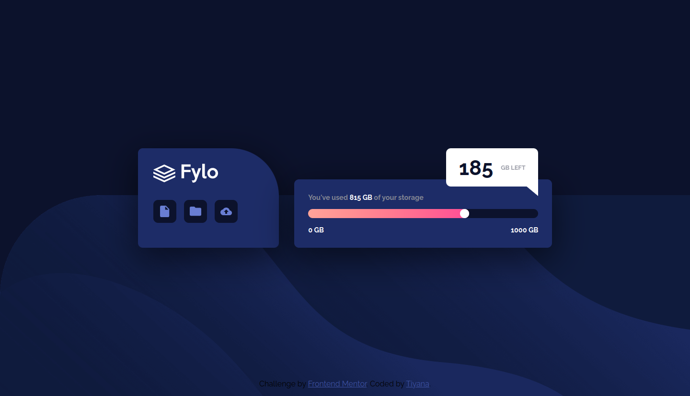
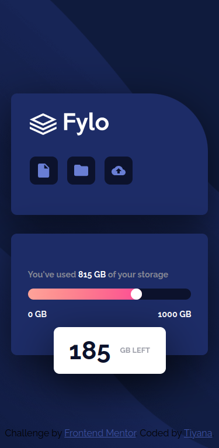

# Frontend Mentor - Fylo data storage component solution

This is a solution to the [Fylo data storage component challenge on Frontend Mentor](https://www.frontendmentor.io/challenges/fylo-data-storage-component-1dZPRbV5n). Frontend Mentor challenges help you improve your coding skills by building realistic projects.

## Table of contents

- [Overview](#overview)
  - [The challenge](#the-challenge)
  - [Screenshot](#screenshot)
  - [Links](#links)
- [My process](#my-process)
  - [Built with](#built-with)
  - [What I learned](#what-i-learned)
  - [Continued development](#continued-development)
  - [Useful resources](#useful-resources)
- [Author](#author)

## Overview

### The challenge

Users should be able to:

- View the optimal layout for the site depending on their device's screen size

### Screenshot

Desktop size 1440px


Mobile size 375px


### Links

- Solution URL: [Solution URL here](https://github.com/Tiyana19/Fylo-data-storage-component)
- Live Site URL: [Live site URL here](https://tiyana19.github.io/Fylo-data-storage-component/)

## My process

### Built with

- Semantic HTML5 markup
- CSS custom properties
- Flexbox
- CSS Position properties
- CSS clip path
- CSS z-index property

### What I learned

I have got to know about CSS "Clip path" Property, it was quite useful here:

```
.gb-box::before {
    clip-path: polygon(0 0, 100% 100%, 100% 0);
}
```

Also I have used depth knowledge of "Position: relative and Position: absolute "

other Properties that was big help for me "z-index and pseudo-elements".

### Continued development

I will continue to learn these properties and explore them in depth:

- clip-path
- z-index
- position: relative
- position: absolute
- pseduo-elements

### Useful resources

- [Clip Path](https://bennettfeely.com/clippy/) - This helped me with clip-path property. I really liked this site and will use it going forward.

## Author

- Frontend Mentor - [@Tiyana19](https://www.frontendmentor.io/profile/Tiyana19)
